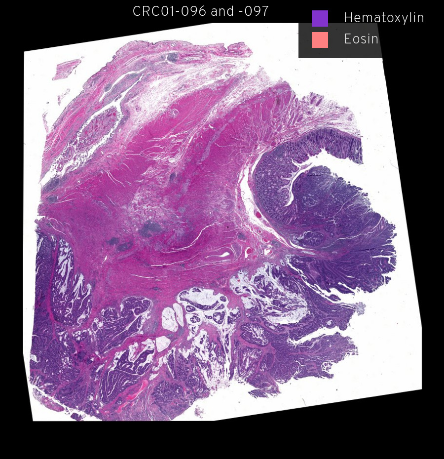

# HTA CRC Atlas 1

The HTA CRC Atlas 1 dataset contains images and other data being used for
construction of an atlas of human colorectal cancer under the auspices of the
[Human Tumor Atlas Network](https://humantumoratlas.org/). Advanced solid
cancers are complex assemblies of tumor, immune, and stromal cells that invade
adjacent tissue and spread to distant sites. We use highly multiplexed tissue
imaging, spatial statistics, and machine learning to identify cell types and
states underlying morphological features of known diagnostic and prognostic
significance in colorectal cancer. This includes the tumor invasive margin,
where tumor, normal, and immune cells compete and were diverse immunosuppressive
environments are found.

## Minerva Stories

[CRC01 introduction   {:width="400px" height="413px"}](story-introduction.html)

[CRC01 overview   {:width="400px" height="406px"}](story-overview.html)

[CRC01 Z-stack   {:width="400px" height="391px"}](story-stack.html)

## About Minerva: Exploring the primary image data in Lin-Wang-Sorger et al.

The images in Lin et al. (2021) comprise a ~4.5 TB dataset with some images as
large as 1 gigapixel.  We provide access to this information without restriction
(as required by the NCI Moonshot effort) but it is not in a convenient form for
reviewers or general users to explore. The open source Minerva software was
designed for the [Human Tumor Atlas Network
(HTAN)](https://humantumoratlas.org/) by the Laboratory of Systems Pharmacology
to address this problem.

Minerva enables intuitive real-time exploration of very large (gigapixel)
high-plex images in the cloud using a web browser. With Minerva, users can pan
around and magnify areas of an image and switch between channels. Minerva does
not require the installation of any software and is therefore secure; browsing
is also anonymous. Users interested in the tool are welcome to explore the
[documentation](https://github.com/labsyspharm/minerva-story/wiki), the
[software publication](https://joss.theoj.org/papers/10.21105/joss.02579), and a
description of [digital
docents](https://www.biorxiv.org/content/10.1101/2020.03.27.001834v2) in
general.

We provide two types of Minerva stories with this paper:

1. “*Data Overviews*” provide access to minimally processed Level 2 images with
   annotation and interpretation kept to a bare minimum.
2. “*Data Explorations*” are like museum guides and exploit the digital docents
   in Minerva to guide readers through the complexities of a large image dataset
   via a series of narrated stories and waypoints. Both written and audio
   narration are supported, as well as free exploration. These will be linked to
   individual figure panels in the final manuscript.
